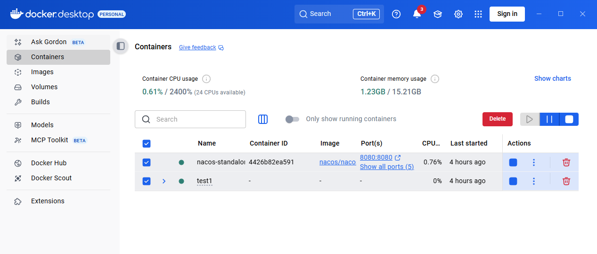
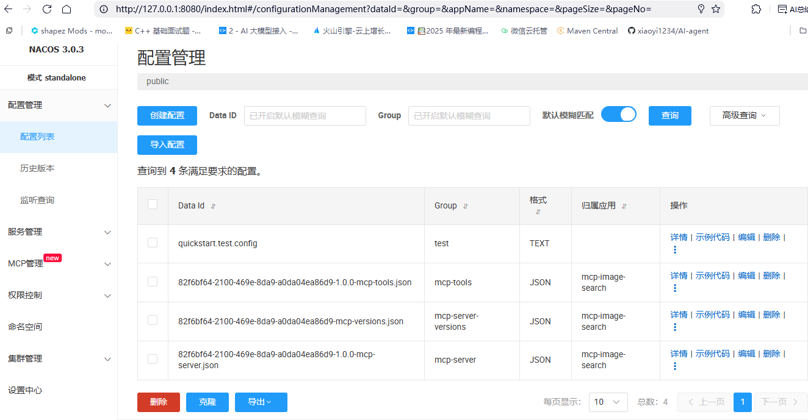
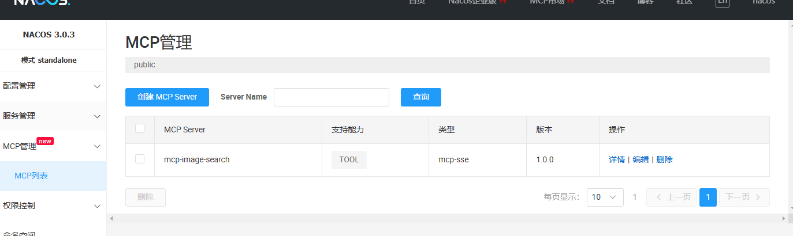
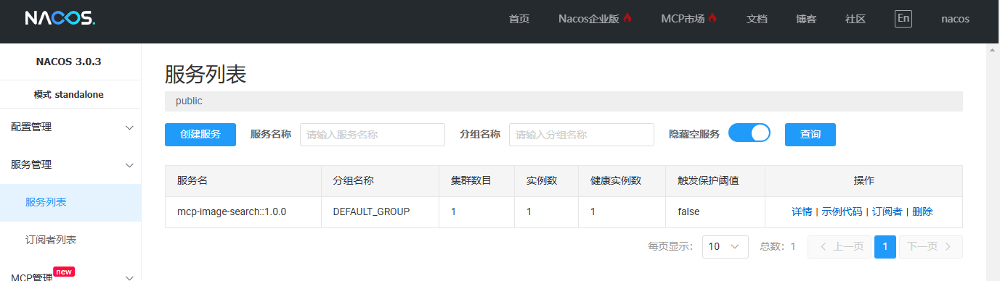

# Test1 - AI Agent 全栈项目

## 项目简介

Test1 是一个基于 Spring Boot + Vue3 的 AI Agent 全栈项目，集成了多种 AI 模型调用方式、RAG（检索增强生成）功能、MCP（Model Context Protocol）服务发现、聊天记忆管理以及各种实用工具。项目采用微服务架构，支持 Docker 容器化部署。
## 🏗️ 项目架构

```
Test1/
├── src/                          # 主应用后端
│   ├── main/java/com/xiaoyi/test1/
│   │   ├── App/                  # 应用核心模块
│   │   ├── agent/                # AI Agent 系统
│   │   ├── controller/           # REST API 控制器
│   │   ├── rag/                  # RAG 检索增强生成
│   │   ├── tools/                # 工具生态
│   │   └── ...
│   └── resources/
│       ├── application.yml       # 主配置文件
│       ├── document/             # 知识库文档
│       └── static/               # 静态资源
├── mcp-server/                   # MCP 服务器
│   ├── src/main/java/com/xiaoyi/mcpserver/
│   │   ├── tools/                # MCP 工具实现
│   │   └── McpServerApplication.java
│   └── src/main/resources/
│       └── application.yml       # MCP 服务配置
├── agent-fronted-1/              # Vue3 前端应用
│   ├── src/
│   │   ├── components/           # 可复用组件
│   │   ├── views/                # 页面组件
│   │   ├── api/                  # API 服务
│   │   └── stores/               # 状态管理
│   ├── package.json
│   └── vite.config.js
├── searxng/                      # 搜索引擎配置
├── docker-compose.yml            # Docker 编排
└── README.md
```

## 🚀 主要功能特性

### 🤖 AI Agent 系统
- **多种 Agent 模式**: 支持 ReAct、工具调用等多种 Agent 模式
- **状态管理**: 完整的 Agent 状态管理机制
- **工具集成**: 丰富的工具集支持
- **流式响应**: 支持 SSE 实时流式对话

### 🔍 RAG 检索增强生成
- **文档处理**: 支持 Markdown、PDF 等多种文档格式
- **向量存储**: 集成 PostgreSQL + pgvector 向量存储
- **查询增强**: 智能查询重写和关键词增强
- **知识库**: 内置 PCIe 技术文档知识库

### 🌐 MCP 服务发现
- **Nacos 集成**: 基于 Nacos 的服务注册与发现
- **负载均衡**: 支持 MCP 服务的负载均衡调用
- **服务治理**: 完整的服务健康检查和监控
- **动态配置**: 支持配置热更新

### 🛠️ 工具生态
- **文件操作**: 文件读写、PDF 生成、资源下载
- **网络工具**: 网页抓取、搜索、SearXNG 集成
- **系统工具**: 终端操作、进程管理
- **图像搜索**: 基于 MCP 的图像搜索工具

### 💬 聊天记忆
- **持久化存储**: 基于文件的聊天历史记录
- **上下文管理**: 智能上下文维护
- **会话隔离**: 支持多会话并发

### 🎨 现代化前端
- **Vue3 + Vite**: 现代化前端技术栈
- **响应式设计**: 适配桌面和移动设备
- **实时通信**: SSE 流式响应
- **状态管理**: Pinia 状态管理

## 🛠️ 技术栈

### 后端技术
- **框架**: Spring Boot 3.5.0
- **AI 集成**: Spring AI 1.0.1, Spring AI Alibaba 1.0.0.4
- **服务发现**: Nacos 3.1.0
- **向量数据库**: PostgreSQL + pgvector
- **构建工具**: Maven
- **Java 版本**: 17

### 前端技术
- **框架**: Vue 3 (Composition API)
- **构建工具**: Vite
- **状态管理**: Pinia
- **路由**: Vue Router 4
- **HTTP 客户端**: Axios
- **实时通信**: Server-Sent Events (SSE)

### 基础设施
- **容器化**: Docker + Docker Compose
- **搜索引擎**: SearXNG
- **服务注册**: Nacos server + auto config + auto mcp server
- **负载均衡**: Spring Cloud LoadBalancer




- 
## 🚀 快速开始

### 环境要求
- Java 17+
- Maven 3.6+
- Node.js 16+
- Docker & Docker Compose
- PostgreSQL 12+ (可选，用于向量存储)

### 1. 克隆项目
```bash
git clone [项目地址]
cd Test1
```

### 2. 启动基础设施服务
```bash
# 启动 Nacos (需要单独安装)
# 访问 http://localhost:8848/nacos

# 启动 SearXNG 搜索引擎
docker-compose up -d searxng
```

### 3. 启动 MCP 服务器
```bash
cd mcp-server
mvn spring-boot:run
# 服务将在 http://localhost:18888 启动
```

### 4. 启动主应用后端
```bash
# 在项目根目录
mvn spring-boot:run
# 服务将在 http://localhost:18080 启动
```

### 5. 启动前端应用
```bash
cd agent-fronted-1
npm install
npm run dev
# 应用将在 http://localhost:3000 启动
```

## ⚙️ 配置说明

### 主应用配置 (`src/main/resources/application.yml`)
```yaml
spring:
  ai:
    dashscope:
      api-key: your-dashscope-api-key
    alibaba:
      mcp:
        nacos:
          server-addr: 127.0.0.1:8848
          namespace: public
          username: nacos
          password: nacos
    mcp:
      client:
        enabled: true
        type: sync
        toolcallback:
          enabled: true
```

### MCP 服务器配置 (`mcp-server/src/main/resources/application.yml`)
```yaml
spring:
  ai:
    mcp:
      server:
        name: mcp-image-search
        version: 1.0.0
        type: SYNC
    alibaba:
      mcp:
        nacos:
          server-addr: 127.0.0.1:8848
          register:
            enabled: true
```

### 前端配置 (`agent-fronted-1/src/api/config.js`)
```javascript
const config = {
  development: {
    baseURL: 'http://localhost:18080/api'
  },
  production: {
    baseURL: 'https://your-production-domain.com/api'
  }
}
```

## 📡 API 接口

### AI 相关接口
- `GET /ai/love_app/chat/sse_emitter`: LoveApp 流式聊天接口
- `GET /ai/manus/chat`: Manus 智能体聊天接口
- `POST /ai/chat`: 基础 AI 聊天接口
- `POST /ai/rag`: RAG 检索增强接口
- `POST /ai/tools`: 工具调用接口

### 健康检查
- `GET /health`: 应用健康状态
- `GET /actuator/health`: Spring Boot Actuator 健康检查

### MCP 服务接口
- `POST /mcp/messages`: MCP 消息处理接口

## 🧪 测试

### 后端测试
```bash
# 运行所有测试
mvn test

# 运行特定测试类
mvn test -Dtest=XiaoyiMausTest
```

### 前端测试
```bash
cd agent-fronted-1
npm run test
```

## 🐳 Docker 部署

### 构建镜像
```bash
# 构建主应用镜像
docker build -t test1-backend .

# 构建 MCP 服务器镜像
cd mcp-server
docker build -t test1-mcp-server .

# 构建前端镜像
cd ../agent-fronted-1
docker build -t test1-frontend .
```

### 使用 Docker Compose
```bash
# 启动所有服务
docker-compose up -d

# 查看服务状态
docker-compose ps

# 查看日志
docker-compose logs -f
```

## 🔧 开发指南

### 添加新工具
1. 在 `src/main/java/com/xiaoyi/test1/tools/` 下创建工具类
2. 实现 `@Tool` 注解的方法
3. 在 `ToolRegistration.java` 中注册工具
4. 编写测试用例

### 扩展 MCP 服务
1. 在 `mcp-server/src/main/java/com/xiaoyi/mcpserver/tools/` 下添加工具
2. 在 `McpServerApplication.java` 中注册 ToolCallbackProvider
3. 更新服务配置

### 前端组件开发
1. 在 `agent-fronted-1/src/components/` 下创建组件
2. 在 `agent-fronted-1/src/views/` 下创建页面
3. 更新路由配置

## 🐛 常见问题

### MCP 服务发现问题
如果遇到 `toolCallbackProvider` 为 NULL 的问题：
1. 检查 Nacos 服务是否正常运行
2. 确认 MCP 服务器已注册到 Nacos
3. 验证 `@Autowired` 注解是否正确添加
4. 检查版本兼容性

### 前端连接问题
1. 确认后端服务正常运行
2. 检查 CORS 配置
3. 验证 API 地址配置

## 📊 监控和日志

### 应用监控
- Spring Boot Actuator: `http://localhost:18080/actuator`
- Nacos 控制台: `http://localhost:8848/nacos`
- SearXNG 控制台: `http://localhost:6080`

### 日志配置
```yaml
logging:
  level:
    com.xiaoyi.test1: DEBUG
    com.alibaba.cloud.ai.mcp: DEBUG
    org.springframework.ai.mcp: DEBUG
```

## 🤝 贡献指南

1. Fork 项目
2. 创建功能分支 (`git checkout -b feature/AmazingFeature`)
3. 提交更改 (`git commit -m 'Add some AmazingFeature'`)
4. 推送到分支 (`git push origin feature/AmazingFeature`)
5. 创建 Pull Request


## 📞 联系方式

- 项目维护者: xiaoyi
- 项目地址: https://github.com/xiaoyi1234/AI-agent

## 📝 更新日志

### v2.0.0 (2025-01-23)
- ✨ 新增 MCP 服务发现功能
- ✨ 集成 Nacos 服务注册中心
- ✨ 添加 Vue3 前端应用
- ✨ 支持 SSE 流式响应
- 🔧 优化项目架构和配置
- 🐛 修复 toolCallbackProvider 注入问题

### v1.0.0
- 🎉 初始版本发布
- 🤖 基础 AI Agent 功能
- 🔍 RAG 检索增强生成
- 🛠️ 多种工具集成

---

*最后更新时间: 2025年1月23日*